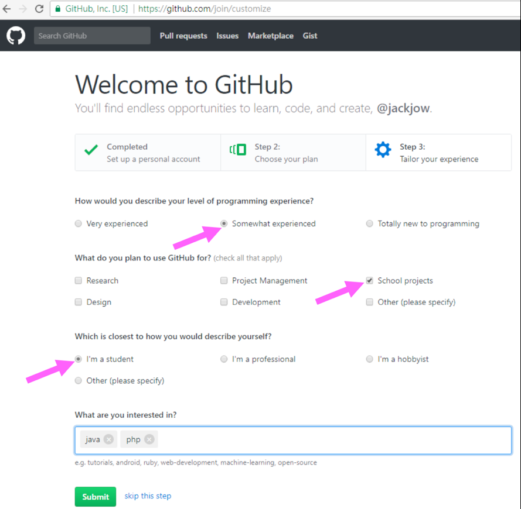
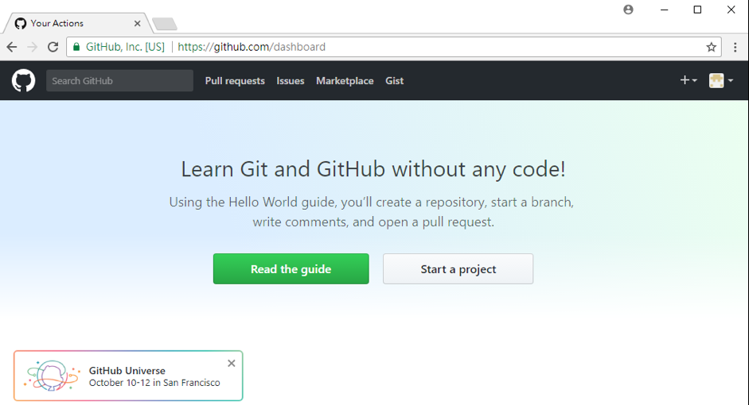
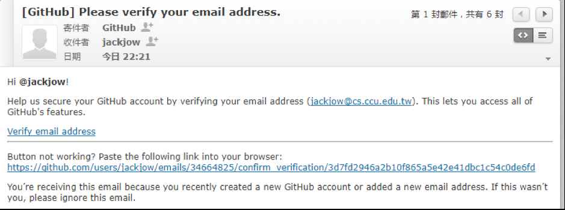

## **GitHub版本控制**

<a href="https://github.com">GitHub</a>
是目前廣被使用的專案版本管控系統，主要功能是協助軟體開發者保留程式開發過程的編改記錄，讓參與開發者可以詳細查看軟體開發脈絡。使用者可以在GitHub的站台上申請免費或付費帳號，免費帳號所建立的程式庫(Repository) 是可以給任何人進行存取的。我們建議使用者申請一個屬於自己的GitHub帳號並持續收集自己曾寫過的程式碼，日積月累自然形成您的程式學習履歷。首先請先搜尋GitHub (見圖2-7)。接著點選右上角的「Sign up」功能並填好資料後送出申請(見圖2-8)。記得要選無限公開程式庫(Repository)才能免費使用GitHub系統(見圖2-9)。另外在申請GitHub帳號時可以以學生身份進行設定(見圖2-10)。成功完成GitHub帳號申請流程會看到圖2-11的畫面，同時您會收到一封GitHub傳的郵件驗證件(如圖2-12所示)，在完成郵件驗證之後便可以開始使用GitHub的版本管控。

Figure 2-? 申請一個新的 Github 帳號

圖 2-9: 申請 GitHub帳號—選擇Unlimited public repositories for free

圖 2-10: 申請為一個學生GitHub帳號

<strong>圖 2-11: 成功申請GitHub帳號時的畫面</strong>
 

圖 2-12: 完成申請後需要完成郵件驗證手續
