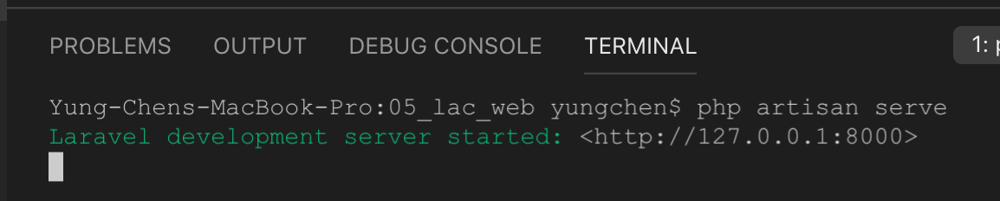
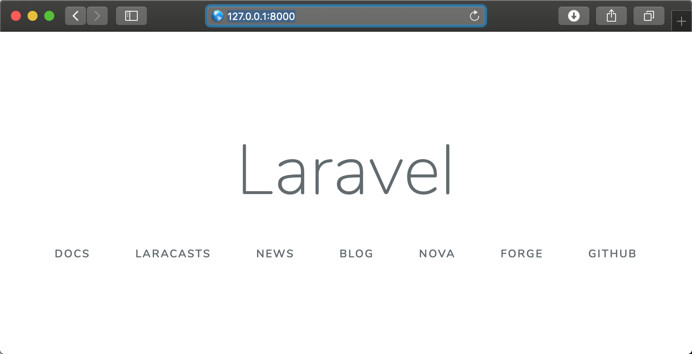

# Getting Start

## Environment setting
### Composer

- Step 1: Download Composer from <a href="https://getcomposer.org/download">HERE</a>


## Initalize a new project

### <span style="background: rgb(192, 192, 192);">Approach 1:</span>
The documentation can be found at <a href="https://laravel.com/docs/5.8">https://laravel.com/docs/5.8</a>

```
composer create-project --prefer-dist laravel/laravel projectName
```


### <span style="background: rgb(192, 192, 192);">Approach 2:</span>

You can use following instructions to create a Laravel project:
```
laravel new projectName
```


<h4 style='background: rgb(255, 255, 0);'>Troubleshooting</h4>
If you got the truble with the ```laravel new projectName``` instruction on Mac System, then you can apply following steps to solve the problem. 

* Step 1: edit '~/.bash_profile'
```vim ~/.bash_profile ```
* Step 2: add ```export PATH=~/.composer/vendor/bin:$PATH``` to .bash_profile file
* Step 3: Reopen the Terminal and excute ```laravel new projectName``` instruction again to create the new project.
  
### <span style="background: rgb(255, 255, 0);">Preview the result of laravel project</span>
run the following instructions in Termial, then the tool will show the link address.
```
php artisan serve
```



## Using xampp to preview Laravel project

### Mac OS
* Step 1: install apache on Mac
* Step 2: download MySQL server dmg file from [<a href="https://dev.mysql.com/downloads/mysql/">HERE </a>]   
* Step 3: edit .bash_profile file in user's home folder ``` vim ~/.bash_profile ``` then add ``` export PATH="/usr/local/mysql/bin:$PATH" ``` setting into the file. 

* Step 4: use ``` source ~/.bash_profile ``` to apply the settings.

* Step 5: Set root's password of MySQL 
  * Step 5.1: run ``` sudo mysql start ``` to start mysql server
  * Step 5.2: login to mysql server with ``` mysql -u root ``` instruction in terminal. <span style="background: red;">Note: the default password of root is blank (i.e. no password)</span>
  * Step 5.3: exit mysql after stting root password
* Step 6: create a database for your Laravel project
  * Step 6.1: login mysql server using root with instruction ``` mysql -u root -p ```

* Step 7: Download <a href="https://dev.mysql.com/downloads/file/?id=488575">MySQL workbench</a> and install it on Mac 
* Step 8: manage database by using MySQL workbench


